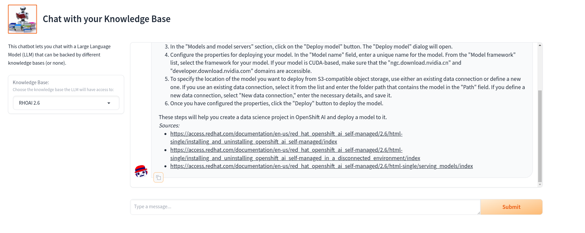

# How to deploy an LLM on RedHat OpenShift
This repository is a quick walkthrough on the steps required to deploy large language models on Red Hat OpenShift (OCP). This is an adapted guide inspired by the docs, guides and examples provided on [ai-on-openshift.io](https://ai-on-openshift.io/generative-ai/llm-serving/).

This guide provides the steps applicable for an OCP 4.13.x instance deployed on AWS, however the steps are similar for other cloud providers and on-prem deployment of the OCP platform. A video guide of the environment setup walkthrough is available [here](https://youtu.be/JPndKASUm1s). Please note that there are two additional videos describing how to use (experiment) with the LLM to chat with your documentation (described later in this document), as well for adding an UI for the chatbot. These additional video links are provided below in the respective sections of the document.

This guide will deploy the [Mistral-7B-Instruct-v0.2](https://huggingface.co/mistralai/Mistral-7B-Instruct-v0.2) model. Instructions on how to retrieve the model files are provided on the Hugging Face website where the model is hosted.

## Prerequisites

Hosting an LLM on OCP can be done with or without a GPU. For performance reasons, it is recommended to proceed with a GPU. You may deploy without GPU however the responsiveness of the model will be much slower. This guide assumes, in the first part, that a GPU shall be used (as a requirement from one of the containers deployed from [Quay](https://quay.io)). 
A second part will describe options for CPU based deployments.

## GPU based setup

The OCP platform requires a number of operators to be installed and available in order to perform the actual deployment as depicted in the below picture (name and version used for this demo):


Install the operators in the following order:
1. Install RedHat OpenShift Pipelines - while this operator is not directly required for LLM deployment, it is a dependent operator for having all the functionality in the RedHat OpenShift AI operator (RHOAI), namely the data-science pipelines
2. Install RedHat OpenShift Data Foundation and configure it in a MultiObject Gateway setting since we only need the object store component provided by the storage operator. This provides the S3 compatible storage requred by RHOAI's data connection as the model storage location.
3. Install the RedHat OpenShift Service Mesh operator dependencies and the service mesh operator. [Reference documentation](https://docs.openshift.com/container-platform/4.13/service_mesh/v2x/installing-ossm.html). *Note: Do not configure the ServiceMesh operator after installation!!!*
   1. Install the OpenShift Elasticsearch operator
   2. Install the RedHat OpenShift distributed tracing platform (Jaeger)
   3. Install the Kiali operator
   4. Install the RedHat OpenShift Service Mesh operator
4. Install the RedHat OpenShift Serverless operator. [Reference documentation](https://docs.openshift.com/serverless/1.30/install/install-serverless-operator.html). *Note: Do not perform any configuration on the operator after installation!!!*
5. Ensure you have GPU nodes on your cluster. For AWS, follow [this](https://cloud.redhat.com/blog/creating-a-gpu-enabled-node-with-openshift-4-2-in-amazon-ec2) guide.
6. Install NVidia operators:
   1. Install the Node Feature Discovery (NFD) Operator and configure it. [Reference documentation](https://docs.nvidia.com/datacenter/cloud-native/openshift/23.9.1/install-nfd.html#install-nfd).
   2. Install the Nvidia GPU operarator and configure it. [Reference documentation](https://docs.nvidia.com/datacenter/cloud-native/openshift/23.9.1/install-gpu-ocp.html#install-nvidiagpu).
7. Install the RedHat Openshift AI operator and create a default cluster. The default configuration should deploy KServe and allow you to deploy single model serving. Before creating your default RHOAI cluster, you can verify your setup by performing the checks from [here](https://access.redhat.com/documentation/en-us/red_hat_openshift_ai_self-managed/2.5/html/working_on_data_science_projects/serving-large-language-models_serving-large-language-models#configuring-automated-installation-of-kserve_serving-large-language-models).

## Configure a serving runtime

This [repo](https://github.com/rh-aiservices-bu/llm-on-openshift/blob/main/serving-runtimes/vllm_runtime/README.md) provides the step by step information for quyickly adding a [vLLM](https://docs.vllm.ai/en/latest/index.html) serving runtime.

In our case, we used a g5.xlarge machine having an A10 GPU to deploy our model. Generally, you need on the host VM the amount of RAM >= the amount of VRAM. In our case however, this condition is not satisfied, as the g5.xlarge machines have 16 GiB of RAM and the A10 card has 24 GiB of VRAM. Therefore, we need to tweak the arguments for the vLLM container deployment and add some parameters that will force the engine to shrink the model (process known as quantization).
We need to add:
 * dtype as float16
 * max-model-len as 5900

So the `vLLM.yaml` should look like below:
```
apiVersion: serving.kserve.io/v1alpha1
kind: ServingRuntime
labels:
  opendatahub.io/dashboard: "true"
metadata:
  annotations:
    openshift.io/display-name: vLLM
  name: vllm
spec:
  builtInAdapter:
    modelLoadingTimeoutMillis: 90000
  containers:
    - args:
        - --model
        - /mnt/models/
        - --dtype
        - float16
        - --max-model-len
        - "5900"
        - --download-dir
        - /models-cache
        - --port
        - "8080"
      image: quay.io/rh-aiservices-bu/vllm-openai-ubi9:0.3.1
      name: kserve-container
      ports:
        - containerPort: 8080
          name: http1
          protocol: TCP
  multiModel: false
  supportedModelFormats:
    - autoSelect: true
      name: pytorch
```

Deploy this YAML inside the Serving Runtimes configurations of RHOAI as described [here](https://github.com/rh-aiservices-bu/llm-on-openshift/blob/main/serving-runtimes/vllm_runtime/README.md).

## Deploy the LLM model

Once you locally downloaded the Mistral model files, you need to place them on the S3 storage that will be used as a data connection inside your RHOAI project.
Head over to the RHOAI console and:
1. Create a Datascience project (e.g. test-llm).
2. Switch to the OCP console and select the newly created project. Go on the Storage options and create an object blucket claim (e.g. llm-bucket). Use the credentials you obtain to
   1. Configure on your local `.aws` folder the credentials profile for the bucket you created so that you can upload the files using the `aws` [cli](https://docs.aws.amazon.com/cli/latest/userguide/install-cliv2-linux.html#cliv2-linux-install) tool.
   2. Configure the Data Connection inside your RHOAI project (the test-llm).

Next, move out (or delete) the git cache files you downloaded (the .gitignore and .git folder from where your model was downloaded) and then upload the model files to the bucket. Make sure you do not upload directly to the root folder, the files need to be placed in folder other than the root, i.e. Mistral-7B-Instruct-v0.2.
The command to upload the files should look like: 

```bash
aws s3 sync --profile=llm-bucket --endpoint=<your OCP S3 route endopoint> ./Mistral-7B-Instruct-v0.2 s3://<llm-bucket-name>/Mistral-7B-Instruct-v0.2/
```

*Note the /Mistral-7B-Instruct-v0.2/ after the name of the bucket.*

Next, within the RHOAI dashboard, select your data-science project and deploy a Single Serving instance under 'Models and models and servers sections' of the project using the vLLM instance type you added in the earlier step. When deploying the instance ensure you select GPU and use a custom size deployment and define the limits depending on your available resources. For example, if using a g5.xlarge ensure your memory limits are between 8GiB and 14GiB of RAM and CPU limites between 2 and 3 cores.

Next, the model deployment will automatically kick off from the defined data connection. Please be patient here, it will take some time for the model to deploy and the KServe pods and services to become available (approximately 15-20 minutes).
As soon as your model is deployed, you will see the inference endpoint available in the RHOAI dashboard.

## Test the LLM model

Once deployed, you can test your model either directly using some `curl` based commands or via code. You can find an example notebook that uses [LangChain](https://python.langchain.com/docs/get_started/introduction) in this repository.

For a cli quick test, you can issue the following:
```bash
curl -k <inference_endpoint_from_RHOAI>/v1/completions  -H "Content-Type: application/json"       -d '{ \
          "model": "/mnt/models/", \
          "prompt": "Describe Paris in 100 words or less.", \
          "max_tokens": 100, \
          "temperature": 0 \
      }'
```

## How to "chat" with your documentation?

As explained [here](https://ai-on-openshift.io/generative-ai/llm-serving/#context-and-definitions), in order to use a generic LLM to perform a specific task you can fine tune it (a.k.a retrain), or use RAG (retrieval-augmented generation). While fine-tuning is more effective, it may also be more expensive to perform. Another less expensive way of enhancing the LLM's knowledge is by using RAG which we shall present next.

The video walkthrough is available [here](https://youtu.be/VhmLKkNMjKI).

The procedure is as follows:
1. Deploy a Vector database. [Milvus](https://milvus.io/) is an open-source vector databae that can also run on Kubernetes environments like Red Hat OpenShift. A deployment guide is available [here](https://github.com/rh-aiservices-bu/llm-on-openshift/tree/main/vector-databases/milvus). The video walkthrough uses the single (standalone) deployment.
2. Note that as recommended in the deployment guide, the default password should be changed. The user and the new-password should then be added as environment variables to the data-science project defined at the LLM deployment step inside the RHOAI dashboard.
3. Use the [document ingest](notebooks/Milvus-ingest-LangChain.ipynb) notebook to get some PDF files (the RHOAI documentation), create embeddings and ingest the vectors in the Milvus instance
4. Use the [RAG example](notebooks/RAG-example-vLLM-Milvus-LangChain.ipynb) notebook to LLM model capabilities of "chatting" with your documentation (ingested in step 3).

### Adding an User Interface

In order to use in a controlled and secure way the access to the LLM an interfacing application is recommended that exposes some user friendly interface.
An example of such application is provided in the [chatbot-ui](chatbot-ui) folder of this repository. Please note that alongside the source code the folder contains also necessary files to build a container and configurations for Red Hat OpenShift to run the application.

*NOTE: The video mentions using v1.1 for the hatbot image. Please use v1.2 instead as it appears that a token is required to use a specific model for `langchain.embeddings.huggingface.HuggingFaceEmbeddings` and to avoid that we shall use the default instance.*

The deployment walkthrough is provided [here](https://youtu.be/n2ba3vAvELM).

The steps are as follows:
1. Create a new project inside Red Hat OpenShift using either the console or the cli tool. Let's assume the project is called `hatbot`
2. Add the two config maps to the project, either via the cli or by using the console
3. Add the `service.yaml` to the project to create the service for the deployment.
4. Add the `deployment.yaml` to the project. Please note the deployment uses a ready container stored in [quay.io](https://quay.io/repository/avitui/gradio-rag-milvus-vllm-openai) and uses version `v1.2` of the container. The deployment is scaled down to zero by default, so ensure you scale it up after you verify the environment parameters.
5. Create a route for the earlier created service so that you can access the UI outside of the cluster.

Once loaded the UI should look like below:


The UI application provided here is a very basic one nevertheless it provides sufficient context to understand what elements should be present in a real, production ready type of UI.

This was the final part of the GPU based demo. I hope you enjoyed it.

## CPU based setup

Deploying an LLM using a CPU-only setup is possible, however, there are certain limitations to be considered when doing so, especially when thinking about the speed and responsiveness of the LLM.

Red Hat OpenShift AI comes with several options for CPU only serving for LLMs (Caikit TGIS, TGIS standalone, OpenVino model server). Additionally, other serving runtimes may be added (as presented earlier in the demo, where we added a vLLM serving runtime), such as Ollama and vLLM. To be noted that vLLM requires CPUs with AVX-512 instruction set in order to work.

While Ollama is significantly faster than the other serving runtimes, noteworthy is the aspect that the models packed by Ollama are "altered" from the original ones (published by the model creators), and, most importantly, you can only deploy with Ollama whatever exists in the Ollama repository. In other words, you can't deploy with Ollama a custom model that you specialized with your own data. This limitation does not apply for the other serving runtimes.

The resources provided to configure the cluster with CPU based LLM serving are available in this repository and the video guide on how to perform the deployment is [here](https://youtu.be/oewfzPxLJdU)

This concludes the setup for the CPU based demo.

